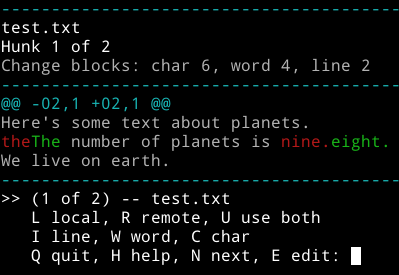

# dispatch-merge
This is a command-line tool for resolving merge conflicts inspired by [dispatch-conf](https://wiki.gentoo.org/wiki/Dispatch-conf).
It is optimized for quick and simple resolution of obvious conflicts.

It includes:
* one key resolution for simple conflicts
* heuristic selection of diff mode (character, word, line)
* support for using $EDITOR to resolve conflicts

# Downloads
Pre-built binaries are available [here](https://bitbucket.org/rdnetto/dispatch-merge/downloads) for 64-bit Linux and OS X.
An ebuild is also available for Gentoo users in my [overlay](https://github.com/rdnetto/rdnetto-overlay.git).

# Build instructions
* Install [Stack](http://docs.haskellstack.org/en/stable/README/#how-to-install) and run `stack setup`, if you have not done so already.
* Run:

        stack install

# Usage
You can either pass the filenames of the files you wish to resolve to it directly, or simply invoke it in a git repository with conflicted files.

# TODOs
* show no. of files remaining
* show commits responsible for changes
